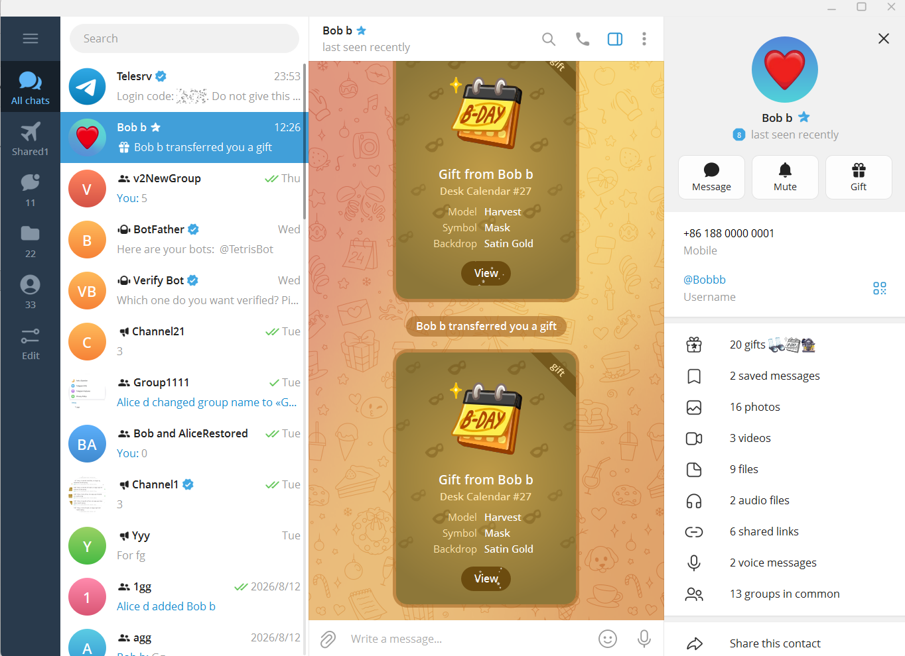
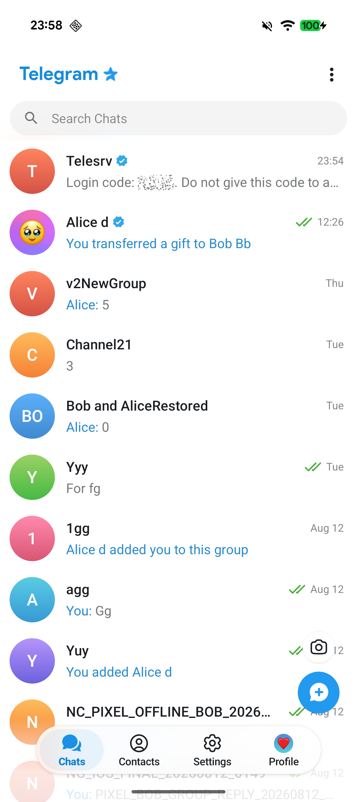
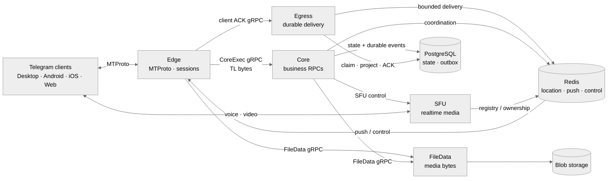

# gramsrv

**Own the server. Speak MTProto. Use real Telegram clients.**

`gramsrv` is an open-source Telegram-compatible server and MTProto backend
written in Go. It is built for self-hosted networks, protocol research, and
community-driven chat systems that need real client compatibility—not just a
Telegram-like interface.

[Website](https://telesrv.net) · [OwpenGram client](https://owpengram.org/) · [Discussion group](https://t.me/telesrv_chat) · [Channel](https://t.me/telesrv) · [中文 README](README.zh-CN.md)

  
  

## Why gramsrv

Most Telegram clones reproduce the interface. `gramsrv` implements the server
side of the protocol so compatible clients can communicate through
infrastructure you control.

- Real MTProto transport, authentication, encrypted sessions, RPC dispatch,
  updates, and multi-device synchronization.
- A practical feature surface covering chats, channels, media, reactions,
  gifts, bots, calls, and administration.
- Open server code from the protocol edge to business services, storage, and
  realtime media.
- A Go codebase designed for compatibility work, experimentation, and
  long-term community development.

The protocol stack is built on the published
[`github.com/iamxvbaba/td`](https://github.com/iamxvbaba/td) module and follows
current Telegram Desktop wire behavior.

## Choose your architecture

| Branch | Architecture | Best fit |
|---|---|---|
| [`main`](../../tree/main) | Monolith | A straightforward single-process server for development, evaluation, and smaller deployments. |
| [`v2`](../../tree/v2) | Microservices | A split runtime with independent service boundaries for scaling, reliability, and production-oriented operation. |

## v2 at a glance

Connections stay at the Edge, business execution stays in Core, and reliable
delivery remains durable through Egress.

## What works today

- Accounts, contacts, profiles, privacy, presence, and multiple sessions.
- Private chats, groups, supergroups, channels, topics, invites, and public
  links.
- Durable updates, dialogs, read state, drafts, reactions, offline recovery,
  and multi-device synchronization.
- Photos, documents, stickers, GIFs, voice messages, previews, uploads, and
  downloads.
- Gifts and Stars, Premium flows, bots and mini apps, translation, and AI
  compose integrations.
- Private-call signaling, group calls, RTMP live streams, and standalone SFU
  ownership.

Telegram Desktop is the primary compatibility target. Android, iOS, and Web
client paths are also actively covered. Some advanced features remain
compatibility-first or experimental, but the implementation is open in this
repository.

## Clients

Stock Telegram clients trust Telegram's production data centers and RSA keys,
so they do not connect to private servers without a small endpoint and key
patch. Use a compatible client from the [project website](https://telesrv.net)
or build your own patched client.

[OwpenGram](https://owpengram.org/) is a multi-server Telegram-style client
with built-in support for `gramsrv`, private deployments, community nodes, and
the official network from one client experience.

## Build it with us

Compatibility reports, focused fixes, tests, and performance work are welcome.
The most useful reports include the client version, reproducible steps, and the
affected RPC or feature path.

Contributor: [ajarshia](https://github.com/ajarshia) — Android Persian (`fa`)
language pack.

## License and independence

`gramsrv` is released under the [Apache License 2.0](LICENSE). It is independent
and unofficial, and is not affiliated with, endorsed by, or sponsored by
Telegram or its official team.
